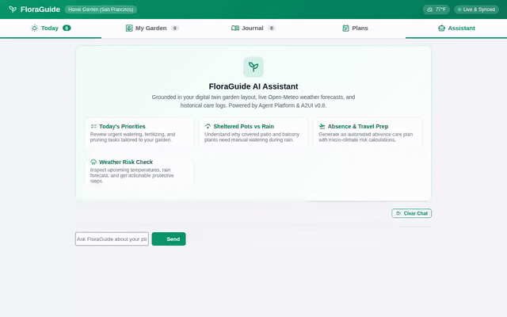

# 🌿 FloraGuide — Personal Context-Aware Gardening Assistant

FloraGuide is a context-aware gardening assistant built with the **Google Agent Development Kit (ADK)** and **agents-cli**. It models your specific growing areas and microclimates (sheltered balconies, patios, raised beds, indoor setups), pulls real-time environmental conditions, maintains plant histories and observation logs, and delivers personalized care recommendations and travel plans.

<div align="center">



*FloraGuide in action: synthesizing live weather with sheltered container microclimates, querying Cloud Firestore, and rendering structured A2UI cards.*

</div>

---

## 🎯 What FloraGuide Does

- **Microclimate & Shelter Awareness:** Differentiates between open ground and sheltered environments (balconies with overhangs, covered patios, greenhouses). When rain is forecast, FloraGuide reminds you that sheltered pots receive zero ambient precipitation and still need manual watering.
- **Observation-Driven Care:** Real physical observations ("soil damp at 2 inches", "leaves drooping") take precedence over weather forecasts to prevent root rot or dehydration.
- **Cross-Session Memory & Allergy Safety:** Remembers user preferences, physical garden constraints (e.g., heavy pots that cannot be moved, water hose reach), and health sensitivities/allergies across sessions, proactively preventing hazardous plant or chemical recommendations.
- **Visual Garden Planner & Digital Twin:** An interactive 2D canvas planner and 3D visualizer for garden zones, accompanied by an instant 1-click **Load Example Garden** (Sunny Patio, Raised Vegetable Beds, Herb Corner, and Shaded Flower Bed).
- **Travel Absence Planning:** Generates a structured 3-phase absence plan (pre-departure hardening, absence care, and return inspections) with risk stratification by container volume and exposure.
- **Botanical Video Generation:** Uses Google Omni to create cinematic time-lapse and plant care videos, streaming artifacts directly to Cloud Storage and the session panel.

---

## 🏗️ Architecture & Wired Google Cloud Services

The capabilities below are fully wired and implemented in `app/agent.py` and `app/gardening_tools.py`:

| Service / Capability | Implementation Details |
| :--- | :--- |
| **Foundation Model** | `gemini-2.5-flash` via Google Vertex AI / Agent Development Kit (ADK). |
| **Agent Platform Memory Bank** | `PreloadMemoryTool` and `generate_memories_callback` (`add_session_to_memory`) persist cross-session facts, allergy sensitivities, and garden constraints. |
| **Google Cloud Firestore** | Reads and writes plant records, sunlight requirements, watering cycles, and observation logs in the `garden_plants` collection. |
| **Google Cloud Storage (GCS)** | In-memory upload of generated video assets to a dedicated Cloud Storage bucket with public HTTPS URLs (zero disk writes). |
| **Google Omni Video Generation** | `gemini-omni-flash-preview` on global Vertex AI endpoint generates 5-second botanical videos in 16:9 or 9:16 aspect ratios. |
| **Agent Engine Code Sandbox** | `AgentEngineSandboxCodeExecutor` configured to execute Python computations (evapotranspiration, water deficit calculations) in an isolated cloud environment. |
| **Agent-to-UI (A2UI)** | A2UI v0.8 schemas (`BasicCatalog`) emitting structured UI components (`Card`, `Column`, `Row`, `Text`, `Image`) rendered directly by the frontend. |
| **Agent-to-Agent (A2A)** | Protocol support enabled in `agents-cli-manifest.yaml` and backend routing for multi-agent interoperability. |
| **Google Maps Platform** | `geocode_address` (Geocoding API) and `find_nearby_places` (Places API New) to locate local nurseries, garden centers, and suppliers. |
| **Open-Meteo & Solar APIs** | Live weather forecasts (temperature, precipitation probability, humidity, frost/heat warnings) with staleness tracking, combined with Sunrise-Sunset solar photoperiod tracking. |

> [!NOTE]
> **Implementation Status of Brief Items:**
> - **Video Generation:** Fully implemented with Google Omni (`gemini-omni-flash-preview`).
> - **Static Image Generation:** *Planned, not yet implemented.* (Image generation mentioned in the initial concept brief was superseded by the Omni video generation tool).

---

## 🛠️ Implemented Tools

All tools are implemented in `app/gardening_tools.py` and registered with the agent in `app/agent.py`:

### 1. Garden Layout & Profiles
- `get_garden_summary`: Retrieves the garden layout, growing areas, registered plants, and recent observations.
- `add_or_update_growing_area`: Creates or updates growing zones (patio, balcony, raised bed, open ground, greenhouse).
- `add_or_update_plant`: Adds or updates plant profiles with container dimensions, substrate, and drainage attributes.

### 2. Environmental Monitoring & Weather
- `check_local_weather`: Fetches live weather, precipitation likelihood, temperature, and frost/heatwave risk flags from Open-Meteo.
- `get_daylight_and_photoperiod`: Computes sunrise/sunset, total daylight hours, and photoperiod classifications (short-day vs. long-day).

### 3. Care & Planning
- `generate_conditional_care_plan`: Produces rule-based, evidence-backed daily care priorities synthesizing weather and plant microclimates.
- `plan_travel_absence`: Prepares a 3-stage travel departure and maintenance strategy based on trip duration and container risk tiers.
- `record_plant_observation`: Records physical observations ("soil damp", "powdery mildew", "new shoot growth").
- `record_plant_watering`: Records watering timestamps and notes.
- `search_gardening_knowledge`: Queries botanical care guides, companion planting recommendations, and pest management.

### 4. Cloud Firestore Integration
- `list_garden_plants_firestore`: Queries stored plants from Cloud Firestore `garden_plants`.
- `get_garden_plant_firestore`: Fetches a single plant document by ID.
- `add_or_update_firestore_plant`: Writes or updates plant records in Firestore.
- `log_firestore_plant_observation`: Appends observations to a Firestore plant timeline.

### 5. Media & Location Tools
- `generate_plant_video`: Generates short botanical videos via Google Omni (`gemini-omni-flash-preview`), saves them as session artifacts, and uploads bytes to Cloud Storage.
- `geocode_address`: Resolves garden or user addresses into latitude/longitude coordinates.
- `find_nearby_places`: Searches for nearby nurseries, garden centers, or plant supply stores.

---

## 🖥️ Web Frontend Views

FloraGuide includes a responsive web dashboard served by FastAPI:

1. **Today View:** Glanceable metrics (total plants, pending tasks, weather status), daily action checklist, and quick care triggers.
2. **My Garden (Visual Planner):**
   - **2D Canvas Planner:** Interactive drawing tool for growing zones, plant containers, and paths.
   - **3D Garden View:** Real-time Three.js visualization with realistic plant meshes, procedural textures, and day/night lighting.
   - **Load Example Garden:** 1-click action pre-populating an authentic multi-zone garden (Sunny Patio, Raised Vegetable Beds, Herb Corner, Shaded Flower Bed) with editable profiles and journal entries.
3. **Journal View:** Chronological feed of timestamped plant observations, health notes, and care milestones.
4. **Plans View:** Dedicated vacation and absence preparation calculator.
5. **Assistant View:** Native A2UI chat interface supporting quick prompts, real-time typing indicators, and rich card rendering.

---

## 🚀 Local Setup & Running Instructions

### Prerequisites
- Python 3.10+
- [uv](https://docs.astral.sh/uv/) (Python package manager)
- Google Cloud SDK (`gcloud`) authenticated with a project having Vertex AI and Firestore APIs enabled
- Node.js & npm (optional, only needed if re-recording demo videos with Playwright)

### 1. Configure Environment

From the `my-agent` directory:
```bash
cp .env.example .env
```

Ensure your `.env` contains:
```ini
GOOGLE_CLOUD_PROJECT=your-project-id
GOOGLE_CLOUD_REGION=us-central1
```

Authenticate your local environment with Google Cloud Application Default Credentials:
```bash
gcloud auth login
gcloud auth application-default login
gcloud config set project your-project-id
```

### 2. Install Dependencies

Using `uv`:
```bash
uv sync
```

Or using standard `pip`:
```bash
pip install -e .
```

### 3. Seed Initial Cloud Firestore Data (Optional)

To seed your Cloud Firestore collection with starter garden plants:
```bash
python seed_firestore.py
```

### 4. Run the Agent Application Locally

Start the local web application (serves both the FastAPI backend proxy and the dashboard UI):
```bash
python frontend/main.py
```

The application will start on the configured port (default: 8080). Open your browser and navigate to the address shown in your terminal.

### 5. Running the ADK Dev Playground

To test the raw ADK agent and view session artifacts directly in the ADK playground:
```bash
agents-cli playground
```

---

## 🧪 Running Tests

FloraGuide includes unit and integration test suites:

```bash
# Run all tests
uv run pytest

# Run integration tests specifically
uv run pytest tests/integration/test_server_e2e.py
```

---

## 📄 License

Apache 2.0
